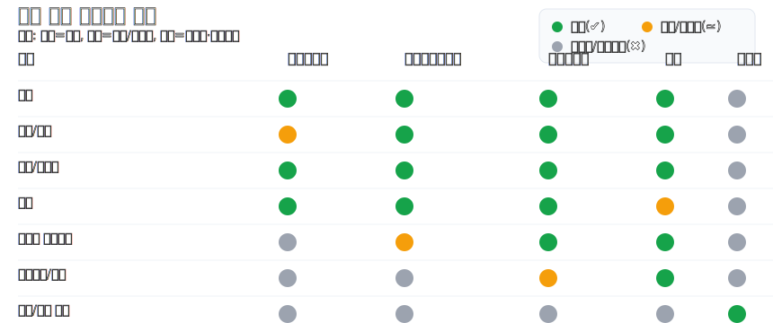

## 한국순교복자수도회 내부결재 시스템 요구사항 정의서

### 문서 정보
- **버전**: 0.1 (Draft)
- **작성일**: 2025-09-16
- **작성 목적**: 한국순교복자수도회의 내부 문서 결재 시스템 구축을 위한 요구사항 정의

### 배경 및 목표
- 수도회 내 모든 결재 문서의 생성, 검토, 승인, 보관을 전자화하여 투명성과 추적성을 확보한다.
- 가장 중요한 목표는 보안과 접근통제이다. 결재 라인 또는 명시된 권한이 있는 사용자만 문서의 원문/메타데이터/첨부파일을 열람할 수 있어야 한다.
- 일반적인 전자결재의 친숙한 UI/UX를 유지하되, 수도회 조직 특성과 역할 체계를 반영한다.
- 전 세계 여러 분원(지사) 구조를 고려하여, 지사/지역 단위의 결재 라우팅과 교차 지사 합의/승인 시나리오를 지원한다.

---

## 범위
- 포함: 문서 기안, 결재선 지정, 검토/전결/합의, 반려/재상신, 결재 이력/감사로그, 문서·첨부 보관, 알림, 통계/대시보드, 사용자/조직/권한 관리, 모바일/웹 접근.
- 제외(초기 버전): 외부 기관 전자서명 연계, 전자계약, 복잡한 ERP 통합. (향후 확장 항목으로 명시)

---

## 사용자 역할 및 권한 모델

### 역할 정의
- **일반수도자**: 문서 기안, 본인 기안 문서 상태 조회, 지정된 결재선 내 검토/합의자일 경우 의견 등록 및 열람.
- **중간관리수도자**: 부서/공동체 단위 결재 권한 보유, 하위 구성원 문서의 승인/반려 권한, 위임/대결 설정.
- **책임수도자**: 기관/사도직 단위 최종 승인 권한, 결재 정책(템플릿, 결재선 룰) 관리 권한.
- **장상**: 최고 권한자. 전결 범위 설정, 접근정책 승인, 긴급 공개/비공개 전환, 규정 관리.
- (시스템) **관리자**: 운영 및 계정/조직 관리. 문서 내용 열람은 원칙적으로 제한되며, 접근은 엄격한 승인/감사 하에서만 허용.

### 접근통제 원칙
- **최소권한 원칙(Least Privilege)**, **필요 시 열람(Need-to-Know)**, **결재선 기반 접근제어**를 철저히 준수.
- 문서는 다음 사용자만 열람 가능:
  - 문서 소유자(기안자)
  - 현재/과거 결재선 참여자(검토자/합의자/승인자)
  - 명시적으로 공유된 사용자(문서별 ACL)
  - 승인된 대결/위임자 (유효 기간 내)
  - 법적/감사 목적의 지정 감사 계정(열람 사유 입력 + 강제 워터마크 + 상세 로그)

### 세부 권한 매트릭스(요약)

| 기능 | 일반수도자 | 중간관리수도자 | 책임수도자 | 장상 | 관리자 |
|---|---|---|---|---|---|
| 기안 | ✔︎ | ✔︎ | ✔︎ | ✔︎ | ✖ |
| 결재/합의 | 결재선 지정 시 | 부서 범위 | 기관 범위 | 전 범위 | ✖ |
| 반려/재상신 | ✔︎ | ✔︎ | ✔︎ | ✔︎ | ✖ |
| 열람 | 본인/참여 문서 | 부서 결재 문서 | 기관 결재 문서 | 정책에 따름 | 원칙적 제한 |
| 결재선 정책관리 | ✖ | 일부 | ✔︎ | ✔︎(최종) | ✖ |
| 접근정책/규정 | ✖ | ✖ | 제안 | ✔︎(승인) | 설정 지원 |
| 계정/조직 관리 | ✖ | ✖ | ✖ | ✖ | ✔︎ |

세부 권한은 RBAC(역할기반) + 문서속성/결재선/소속 기반 ABAC를 조합하여 정책으로 정의한다.

#### 권한 매트릭스 시각화(SVG)


참고: PNG로 내보내기 위해서는 브라우저에서 "다른 이름으로 저장"을 사용하거나, Inkscape 등 도구로 `docs/assets/permissions.svg`를 PNG로 변환할 수 있다.

---

## 결재 프로세스 요구사항

### 기본 흐름
1. 기안자가 템플릿 선택 → 문서 작성 → 결재선 지정(검토/합의/승인, 순차/병렬 지원) → 상신
2. 결재선 참여자에게 알림 발송 → 열람/의견/첨부/결재 수행
3. 반려 시 기안자에게 사유 통지, 수정 후 재상신 가능(버전 관리)
4. 최종 승인 시 문서는 완료 상태로 보관처리, 보존기간 정책 적용

### 상세 규칙
- 결재선 유형: 순차, 병렬, 조건부(금액/문서유형/소속에 따라 분기), 합의 필수/선택.
- 대결/위임: 기간/대상 지정, 모든 열람/결재 행위에 대결자 표시와 워터마크, 상세 감사로그.
- 재기안/재상신: 변경 이력과 비교 뷰 제공, 이전 결재의견 보존.
- 의견/첨부: 댓글 스레드, 멘션, 파일 버전, 미리보기, 악성코드 스캔.
- 회수: 결재 전 단계에서만 허용(정책으로 제한 가능), 회수 이력 기록.
- 강제 승격/긴급 결재: 장상 권한으로 한시적 승인 경로 단축(사유 필수, 감사 강화).
 - 지사/지역 라우팅: 문서의 소속 지사/기관에 따라 기본 결재선이 자동 추천되며, 교차 지사 합의/승인이 필요한 경우 조건부 단계 추가(예: 해외 지사 비용/계약 문서는 본원 책임수도자 최종 승인).
 - 교차 지사 접근: 교차 지사 합의/승인 시 해당 단계 참여자에게만 문서 열람 권한이 부여되며, 완료 후 최소 정보(제목 일부/문서번호)만 메타데이터로 제한 노출.

---

## 보안 요구사항(최우선)

### 인증/접속
- MFA(OTP/푸시), 세션 하이재킹 방지(바인딩: IP/디바이스 지표), 비정상 로그인 탐지.
- 조직 계정 체계/SSO 연동 가능(향후): SAML/OIDC.
 - 지사 지역 정책: 지사/국가별 IP 영역/시간대 기반 접근 정책, 현지 개인정보 규정 반영.

### 권한/데이터 보호
- 서버/전송 **암호화**: 저장 시 AES-256, 전송 시 TLS 1.2+.
- 문서·첨부 **세분화 접근제어**: 문서, 본문 섹션, 첨부 파일별 권한.
- 뷰어 보안: 워터마크(사용자/시간/IP), 화면캡쳐 억제 안내, 대량 내보내기 제한, 프린트 정책.
- 다운로드 제어: 결재선 외 사용자 다운로드 금지. 필요 시 만료형 보안 링크.
 - 지역 경계: 지사 외부 전파 방지 태그(Do-Not-Share Outside Branch) 및 위반 시 경보.

### 감사/추적성
- 모든 보안 관련 이벤트 로그: 로그인/실패, 열람, 검색, 결재, 다운로드, 공유, 권한변경, 정책변경.
- 감사 로그는 별도 보관소에 WORM 정책(변조 방지)으로 저장. 보존기간/파기정책 준수.

### 개인정보/비밀문서
- 문서 등급(일반/대외비/비밀/특정): 등급별 기본 접근 정책 자동 적용.
- 민감정보 마스킹/권한기반 노출, 검색 결과도 권한 기반 하이라이트 제한.

---

## 기능 요구사항

### 문서/양식
- 문서 템플릿 관리(결재선 규칙 포함), 버전/개정 관리.
- 본문 에디터(서식/표/이미지), 자동 번호/목차, 템플릿 필수 필드 검증.

### 결재선/정책
- 조직도/직무 기반 추천 결재선, 금액·문서유형 조건부 결재선.
- 결재 권한 위임/대결, 대결 수행 시 표시 및 제한 규칙.
 - 지사 정책: 지사/지역 단위 결재 규정(한도·문서유형·통화)에 따른 자동 라우팅. 환율/통화 표기 지원.
 - 본원 연계: 특정 문서유형/금액 초과 시 본원(중앙) 책임수도자/장상 단계 자동 삽입.

### 검색/조회
- 권한 기반 통합 검색(제목/본문/첨부), 필터(상태/결재자/기간/등급).
- 개인함(기안/진행/완료/반려/참조), 부서함(권한 내), 지사함(지사 권한 내), 통계/리포트.
  - 지사 간 검색은 기본 차단. 교차 지사 결재 참여자는 해당 문서에 한해 검색 결과 노출.

### 알림/협업
- 실시간 알림(웹/모바일 푸시/이메일), 리마인더/데드라인 설정.
- 댓글/멘션, 변경 이력 구독, 일정 캘린더 연동(선택).

---

## 비기능 요구사항(NFR)
- 가용성: 99.9% 이상(업무시간 기준 초기), 무중단 배포 전략(점진적).
- 성능: 주요 목록/문서 열람 95퍼센타일 1.5s 이내, 검색 3s 이내.
- 확장성: 동시 사용자 확장에 따른 수평 확장 가능.
- 백업/복구: 일/시간 단위 백업, 포인트인타임 복구, DR 계획.
- 감사/규정 준수: 접근통제/암호화/로그 무결성 정기 점검.
- 로그/모니터링: 시스템/보안/애플리케이션 지표 수집 및 경보.

---

## 시스템/아키텍처 가이드(참고 설계)
- 인증/권한: SSO 게이트웨이(선택) → API Gateway → RBAC/ABAC 정책 엔진 → 서비스.
- 데이터: 문서 메타데이터(DB), 본문/첨부(암호화된 Object Storage), 감사로그(별도 WORM 스토리지).
- 검색: 권한 필터링이 가능한 역색인(문서/첨부 인덱스 분리), 결과 집계 시 권한 검사.
- 캐시: 권한 토큰/결재선 정책 캐싱 시 만료·철회 이벤트 반영.
- 지사 멀티테넌시: 단일 인스턴스 내 지사 분리(Branch-ID 스코핑) 또는 지사별 인스턴스 운영. 교차 지사 결재는 안전한 페더레이션 API로 최소 권한 토큰만 교환.

---

## 통합/연동
- 알림 채널: 이메일, 푸시(모바일 앱), 선택적으로 메신저 연동.
- 사용자/조직 동기화: LDAP/AD/CSV 주기 동기화.
- 전자서명/도장: 내부 서명(결재 인증) 우선, 외부 공인서명은 차기 단계.

---

## 감사 및 운영
- 운영자 권한은 높은 수준의 분리(운영=시스템 관리, 데이터 열람 별개 승인이 필요한 절차).
- 감사 계정은 열람 사유/기간 제한, 열람 시 자동 워터마크, 모든 행위 강제 로깅.

---

## 수용 기준(Acceptance Criteria) 요약
- 결재선 참여자 외 사용자는 문서 제목·본문·첨부 어느 것도 열람 불가(메타데이터 최소화 정책).
- 결재선 변경/대결·위임 시 모든 열람/결재 화면에 표시되고 감사로그가 생성됨.
- 등급이 "비밀" 이상 문서는 다운로드가 기본 금지, 뷰어에서만 열람 가능.
- 기안→검토/합의→승인→완료 흐름에서 반려/재상신이 정상 동작하고, 버전 비교가 가능.
- MFA가 활성화된 상태에서 비정상 로그인(새 디바이스/IP) 시 추가 인증이 요구됨.
- 모든 보안 이벤트 로그가 별도 저장소에 변조방지 형태로 저장되고 조회 가능.
 - 지사 시나리오: 지사 문서는 기본적으로 해당 지사 범위 내에서만 검색·열람 가능. 교차 지사 결재 참여자는 해당 문서 단계에서만 열람 가능하며, 완료 후 제한된 메타데이터만 표시.

---

## 가정/제약
- 초기에는 내부망 중심 사용을 가정하되, 외부 접속은 VPN 또는 보안 게이트웨이를 통해 제한적 허용.
- 브라우저 최신 LTS 지원, 모바일은 iOS/Android 최근 2개 메이저 버전 지원 권장.

---

## 용어 정의(발췌)
- **결재선**: 문서 결재를 위해 정의된 참여자들의 순서/병렬/조건 집합.
- **대결/위임**: 결재 권한을 일정 기간 대리 수행하도록 지정하는 기능.
- **ACL**: 문서 개별 접근 권한 목록.
- **WORM**: Write Once Read Many, 변조 방지 저장 정책.
 - **지사(분원)**: 지역/국가별 조직 단위. 문서 소속과 권한 스코프의 1차 기준이 되며 교차 지사 결재 시 최소 권한으로 상호 접근.

---

## 개발환경 및 배포 요건

### 프론트엔드(UI)
- 기술 스택: jQuery 3.x, 순수 HTML/CSS (필요 시 Bootstrap 5.x 적용 가능)
- 브라우저 지원: 최신 LTS(Chrome/Edge/Firefox) 및 iOS/Android 최신 2개 메이저
- 보안/품질 요구: CSP(Content-Security-Policy) 적용, XSS 방지 이스케이프, CSRF 토큰 연동, 정적 리소스 무결성(SRI) 선택 적용
- 번들링: 초기 버전은 번들러 미사용(정적 제공). 필요 시 최소화/압축 도입

### 백엔드(API)
- 기술 스택: Spring Boot 3.x, Java 17 LTS
- 주요 모듈: Spring Web, Spring Security, Spring Data JPA, Validation, Springdoc(OpenAPI)
- 인증/세션: MFA 연동, 세션 기반 또는 JWT 기반 중 정책 결정(쿠키: HttpOnly/SameSite/Secure)
- 권한: RBAC + ABAC 정책 엔진(결재선/문서등급/소속 기반)
- 구성: 다중 프로파일(dev, prod), 외부 설정(.properties/.yml + 환경변수/Secret 관리)
- 로깅/감사: 감사 이벤트 별도 채널로 분리, 불변 스토리지 연동 API 제공
- 로컬 개발 환경에서 완전히 구동되도록 구현 (AWS 연동은 향후 확장 계획)

### 데이터베이스(RDBMS)
- 권장: PostgreSQL 16.x (우선 추천)
  - 장점: 강력한 권한/뷰/함수, 파티셔닝, 확장성, JSONB 보조 저장, Row Level Security 활용 가능
- 대안: MariaDB 10.6+ (운영 단순성 선호 시)
- 스키마 가이드: 결재 문서, 결재선(순서/병렬/조건), 의견, 첨부, 감사로그 테이블 분리
- 보안: 전송(TLS) + 저장 암호화(디스크/스토리지 레벨), 민감 데이터 칼럼 암호화/마스킹
- 성능: 인덱스 설계(상태, 결재자, 기간, 등급), 아카이브 파티션 정책

### 인프라/런타임 (로컬 개발 환경)
- 배포 단위: 단일 JAR 또는 Docker 컨테이너
- 로컬 구성: 로컬 PostgreSQL + Spring Boot 애플리케이션
- 스토리지: 로컬 PostgreSQL DB, 첨부파일은 로컬 파일시스템 (암호화된 디렉토리)
- 개발 환경: IntelliJ IDEA 또는 VS Code, 로컬 터미널에서 실행

### CI/CD(로컬 개발용)
- 목표: PR 시 빌드/테스트, 로컬 개발 환경 구축
- 개발 워크플로우: 로컬에서 직접 실행 및 테스트
- 배포 방식: 로컬 JAR 실행 또는 Docker Compose를 통한 로컬 실행

#### 로컬 개발 워크플로우 예시
```yaml
name: local-dev-ci

on:
  pull_request:
    branches: [ main ]
  push:
    branches: [ main ]

jobs:
  build-test:
    runs-on: ubuntu-latest
    steps:
      - uses: actions/checkout@v4
      - name: Set up JDK 17
        uses: actions/setup-java@v4
        with:
          distribution: temurin
          java-version: '17'
      - name: Cache Gradle
        uses: actions/cache@v4
        with:
          path: |
            ~/.gradle/caches
            ~/.gradle/wrapper
          key: ${{ runner.os }}-gradle-${{ hashFiles('**/*.gradle*', '**/gradle-wrapper.properties') }}
      - name: Build
        run: ./gradlew clean build -x test
      - name: Test
        run: ./gradlew test
      - name: Build Docker image for local testing
        run: |
          docker build -t approval-app:local .
```

### 로컬 개발 시크릿/설정
- 로컬 환경변수: 데이터베이스 접속 정보, JWT/세션 키는 로컬 환경변수로 관리
- 애플리케이션: 프로파일별 DB URL, JWT/세션 키는 application-dev.yml에 로컬 설정으로 관리
- 개발용 시크릿: 로컬 개발용 고정 키 사용 (운영 환경과 분리)

