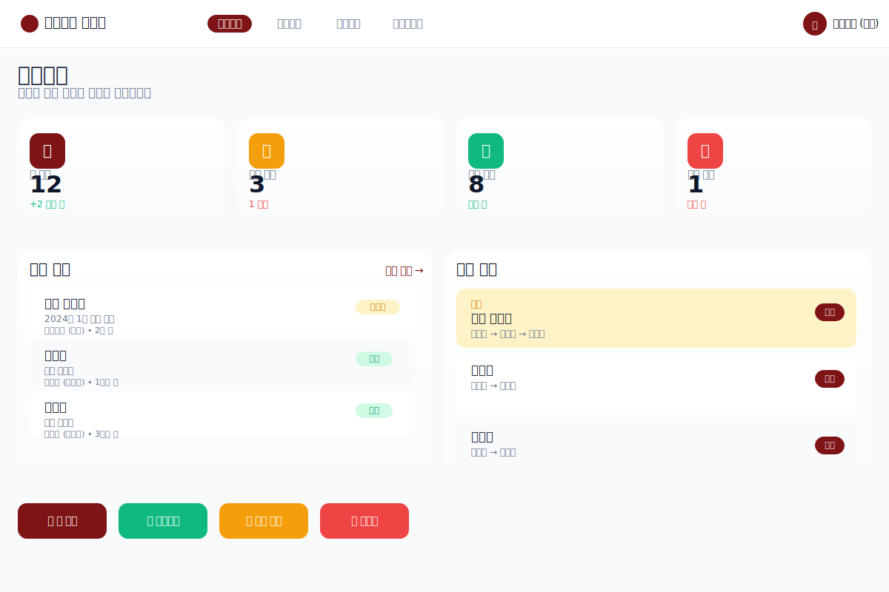
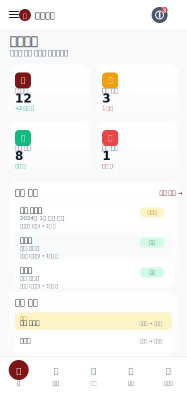

# UI/UX 설계 문서 (Brotherhood 디자인 시스템)

## 1. Brotherhood 디자인 시스템

### 1.1 디자인 원칙
- **현대적**: shadcn/ui 기반의 깔끔하고 모던한 디자인
- **보안 우선**: 접근 권한에 따른 UI 제어, 워터마크 표시
- **직관성**: Radix UI 컴포넌트로 직관적인 인터페이스
- **반응형**: PC/태블릿/모바일 모든 디바이스 지원
- **접근성**: Radix UI 기반으로 WCAG 2.1 AA 수준 완전 준수

### 1.2 Brotherhood 컬러 팔레트
shadcn/ui 기반의 현대적이고 전문적인 컬러 시스템입니다.

```css
:root {
  /* Brotherhood Primary Colors - 메인 브랜드 컬러 */
  --primary: #7e1416;        /* 메인 레드 */
  --primary-foreground: #ffffff;
  
  /* Brotherhood Secondary Colors - 보조 컬러 */
  --secondary: #f59e0b;      /* 앰버/오렌지 */
  --secondary-foreground: #374151;
  
  /* Brotherhood Card Colors - 카드 배경 */
  --card: #fef2f2;           /* 연한 레드 */
  --card-foreground: #374151;
  
  /* Brotherhood Destructive Colors - 파괴적 액션 */
  --destructive: #dc2626;    /* 빨간색 */
  --destructive-foreground: #ffffff;
  
  /* Brotherhood Status Colors - 상태 표시 */
  --success: #10b981;        /* 승인 */
  --warning: #f59e0b;        /* 진행중 */
  --error: #ef4444;          /* 반려 */
  
  /* Brotherhood Background */
  --background: #ffffff;
  --foreground: #374151;
  --muted: #fef2f2;
  --muted-foreground: #374151;
  --border: #e5e7eb;
  --input: #f9fafb;
  --ring: rgba(126, 20, 22, 0.5);
}
```

### 1.3 Brotherhood 타이포그래피
```css
/* Geist 폰트 - Brotherhood 프로젝트 기본 폰트 */
:root {
  --font-family: var(--font-geist-sans), -apple-system, BlinkMacSystemFont, 'Segoe UI', sans-serif;
  --font-size-xs: 0.75rem;    /* 12px */
  --font-size-sm: 0.875rem;   /* 14px */
  --font-size-base: 1rem;     /* 16px */
  --font-size-lg: 1.125rem;   /* 18px */
  --font-size-xl: 1.25rem;    /* 20px */
  --font-size-2xl: 1.5rem;    /* 24px */
  --font-size-3xl: 1.875rem;  /* 30px */
  
  --font-weight-normal: 400;
  --font-weight-medium: 500;
  --font-weight-semibold: 600;
  --font-weight-bold: 700;
  
  --line-height-tight: 1.25;
  --line-height-normal: 1.5;
  --line-height-relaxed: 1.75;
}
```

## 2. PC 버전 메인 대시보드

### 2.1 전체 레이아웃 구조

<figure>
  
  <figcaption>PC 버전 메인 대시보드 레이아웃</figcaption>
</figure>

**레이아웃 특징:**
- **상단 네비게이션**: 깔끔한 탭 기반 네비게이션
- **카드 기반**: 그림자 효과가 있는 현대적인 카드 디자인
- **아이콘 중심**: 직관적인 이모지 아이콘 사용
- **그리드 레이아웃**: 4개 통계 카드의 균형잡힌 배치
- **양쪽 분할**: 최근 문서와 결재 대기를 나란히 배치

### 2.2 컴포넌트

#### 2.2.1 상단 네비게이션
```html
<nav class="top-navigation">
  <div class="nav-brand">
    <div class="logo-icon">📊</div>
    <span class="logo-text">내부결재 시스템</span>
  </div>
  <div class="nav-tabs">
    <a href="/dashboard" class="nav-tab active">대시보드</a>
    <a href="/documents" class="nav-tab">문서관리</a>
    <a href="/approvals" class="nav-tab">결재관리</a>
    <a href="/users" class="nav-tab">사용자관리</a>
  </div>
  <div class="nav-user">
    <div class="user-avatar">김</div>
    <span>김관리자 (요한)</span>
  </div>
</nav>
```

#### 2.2.2 통계 카드 그리드
```html
<div class="stats-grid">
  <div class="stat-card">
    <div class="stat-icon">📄</div>
    <div class="stat-content">
      <div class="stat-label">내 문서</div>
      <div class="stat-value">12</div>
      <div class="stat-change positive">+2 이번 주</div>
    </div>
  </div>
  <div class="stat-card">
    <div class="stat-icon">⏰</div>
    <div class="stat-content">
      <div class="stat-label">결재 대기</div>
      <div class="stat-value">3</div>
      <div class="stat-change warning">1 긴급</div>
    </div>
  </div>
  <!-- 다른 카드들... -->
</div>
```
    
    <div class="container-fluid">
        <div class="row">
            <!-- 사이드바 -->
            <nav class="col-md-3 col-lg-2 d-md-block bg-white sidebar">
                <div class="position-sticky pt-3">
                    <ul class="nav flex-column">
                        <li class="nav-item">
                            <a class="nav-link active" href="/dashboard">
                                <i class="bi bi-house me-2"></i>대시보드
                            </a>
                        </li>
                        <li class="nav-item">
                            <a class="nav-link" href="/documents">
                                <i class="bi bi-file-earmark-text me-2"></i>문서 관리
                            </a>
                        </li>
                        <li class="nav-item">
                            <a class="nav-link" href="/approvals">
                                <i class="bi bi-check-circle me-2"></i>결재 관리
                            </a>
                        </li>
                        <li class="nav-item">
                            <a class="nav-link" href="/users">
                                <i class="bi bi-people me-2"></i>사용자 관리
                            </a>
                        </li>
                    </ul>
                </div>
            </nav>
            
            <!-- 메인 콘텐츠 -->
            <main class="col-md-9 ms-sm-auto col-lg-10 px-md-4">
                <div class="d-flex justify-content-between flex-wrap flex-md-nowrap align-items-center pt-3 pb-2 mb-3 border-bottom">
                    <h1 class="h2">대시보드</h1>
                    <div class="btn-toolbar mb-2 mb-md-0">
                        <button type="button" class="btn btn-primary">
                            <i class="bi bi-plus-circle me-1"></i>새 문서 작성
                        </button>
                    </div>
                </div>
                
                <!-- 통계 카드 -->
                <div class="row mb-4">
                    <div class="col-xl-3 col-md-6 mb-4">
                        <div class="card border-left-primary shadow h-100 py-2">
                            <div class="card-body">
                                <div class="row no-gutters align-items-center">
                                    <div class="col mr-2">
                                        <div class="text-xs font-weight-bold text-primary text-uppercase mb-1">내 문서</div>
                                        <div class="h5 mb-0 font-weight-bold text-gray-800">12</div>
                                    </div>
                                    <div class="col-auto">
                                        <i class="bi bi-file-earmark-text fa-2x text-gray-300"></i>
                                    </div>
                                </div>
                            </div>
                        </div>
                    </div>
                    
                    <div class="col-xl-3 col-md-6 mb-4">
                        <div class="card border-left-warning shadow h-100 py-2">
                            <div class="card-body">
                                <div class="row no-gutters align-items-center">
                                    <div class="col mr-2">
                                        <div class="text-xs font-weight-bold text-warning text-uppercase mb-1">결재 대기</div>
                                        <div class="h5 mb-0 font-weight-bold text-gray-800">3</div>
                                    </div>
                                    <div class="col-auto">
                                        <i class="bi bi-clock fa-2x text-gray-300"></i>
                                    </div>
                                </div>
                            </div>
                        </div>
                    </div>
                </div>
                
                <!-- 최근 문서 목록 -->
                <div class="row">
                    <div class="col-lg-8 mb-4">
                        <div class="card shadow">
                            <div class="card-header py-3 d-flex flex-row align-items-center justify-content-between">
                                <h6 class="m-0 font-weight-bold text-primary">최근 문서</h6>
                                <a href="/documents" class="btn btn-sm btn-primary">전체 보기</a>
                            </div>
                            <div class="card-body">
                                <div class="table-responsive">
                                    <table class="table table-hover">
                                        <thead>
                                            <tr>
                                                <th>문서명</th>
                                                <th>상태</th>
                                                <th>작성일</th>
                                                <th>작성자</th>
                                            </tr>
                                        </thead>
                                        <tbody>
                                            <tr>
                                                <td><a href="/documents/1" class="text-decoration-none">경비 신청서</a></td>
                                                <td><span class="badge bg-warning">진행중</span></td>
                                                <td>2024-01-15</td>
                                                <td>김관리자 (요한)</td>
                                            </tr>
                                            <tr>
                                                <td><a href="/documents/2" class="text-decoration-none">회의록</a></td>
                                                <td><span class="badge bg-success">승인</span></td>
                                                <td>2024-01-14</td>
                                                <td>이사원 (마리아)</td>
                                            </tr>
                                        </tbody>
                                    </table>
                                </div>
                            </div>
                        </div>
                    </div>
                </div>
            </main>
        </div>
    </div>
</body>
</html>
```

## 3. 모바일 버전 메인 화면

### 3.1 모바일 레이아웃 구조

<figure>
  
  <figcaption>모바일 버전 메인 화면 레이아웃</figcaption>
</figure>

**모바일 특징:**
- **컴팩트 헤더**: 햄버거 메뉴와 알림 배지
- **2x2 통계 그리드**: 모바일에 최적화된 카드 레이아웃
- **카드형 리스트**: 깔끔한 문서 목록 표시
- **하단 탭 네비게이션**: 직관적인 5개 탭 구성
- **세로 스크롤**: 콘텐츠를 세로로 배치하여 모바일 최적화

### 3.2 모바일 대시보드 HTML 구조
```html
<!DOCTYPE html>
<html lang="ko">
<head>
    <meta charset="UTF-8">
    <meta name="viewport" content="width=device-width, initial-scale=1.0">
    <title>내부결재 시스템</title>
    <link href="https://cdn.jsdelivr.net/npm/bootstrap@5.3.2/dist/css/bootstrap.min.css" rel="stylesheet">
    <link href="https://cdn.jsdelivr.net/npm/bootstrap-icons@1.11.1/font/bootstrap-icons.css" rel="stylesheet">
    <style>
        @media (max-width: 768px) {
            .mobile-nav {
                position: fixed;
                bottom: 0;
                left: 0;
                right: 0;
                background: white;
                border-top: 1px solid #dee2e6;
                z-index: 1000;
            }
            
            .mobile-nav .nav-link {
                color: #6c757d;
                font-size: 0.75rem;
                padding: 0.5rem;
            }
            
            .mobile-nav .nav-link.active {
                color: #0d6efd;
            }
            
            .stats-card {
                text-align: center;
                padding: 1rem;
            }
            
            .stats-number {
                font-size: 1.5rem;
                font-weight: bold;
                color: #0d6efd;
            }
        }
    </style>
</head>
<body class="bg-light">
    <!-- 모바일 상단 헤더 -->
    <header class="navbar navbar-expand-lg navbar-dark bg-primary fixed-top">
        <div class="container-fluid">
            <button class="navbar-toggler" type="button" data-bs-toggle="offcanvas" data-bs-target="#sidebarMenu">
                <span class="navbar-toggler-icon"></span>
            </button>
            
            <a class="navbar-brand mx-auto" href="/">
                <i class="bi bi-file-earmark-check me-1"></i>내부결재
            </a>
            
            <div class="d-flex">
                <a class="nav-link text-white" href="#">
                    <i class="bi bi-bell fs-5"></i>
                    <span class="position-absolute top-0 start-100 translate-middle badge rounded-pill bg-danger" style="font-size: 0.6rem;">3</span>
                </a>
            </div>
        </div>
    </header>
    
    <!-- 메인 콘텐츠 -->
    <main style="margin-top: 56px; padding-bottom: 80px;">
        <div class="container-fluid p-3">
            <!-- 대시보드 헤더 -->
            <div class="d-flex justify-content-between align-items-center mb-3">
                <h1 class="h4 mb-0">대시보드</h1>
                <button type="button" class="btn btn-primary btn-sm">
                    <i class="bi bi-plus-circle me-1"></i>새 문서
                </button>
            </div>
            
            <!-- 통계 카드 (모바일 2x2) -->
            <div class="row g-2 mb-4">
                <div class="col-6">
                    <div class="card stats-card">
                        <div class="stats-number">12</div>
                        <div class="text-muted small">내 문서</div>
                    </div>
                </div>
                <div class="col-6">
                    <div class="card stats-card">
                        <div class="stats-number text-warning">3</div>
                        <div class="text-muted small">결재 대기</div>
                    </div>
                </div>
                <div class="col-6">
                    <div class="card stats-card">
                        <div class="stats-number text-success">8</div>
                        <div class="text-muted small">승인 완료</div>
                    </div>
                </div>
                <div class="col-6">
                    <div class="card stats-card">
                        <div class="stats-number text-danger">1</div>
                        <div class="text-muted small">반려 문서</div>
                    </div>
                </div>
            </div>
            
            <!-- 최근 문서 (모바일) -->
            <div class="card mb-4">
                <div class="card-header d-flex justify-content-between align-items-center">
                    <h6 class="mb-0">최근 문서</h6>
                    <a href="/documents" class="btn btn-sm btn-outline-primary">전체</a>
                </div>
                <div class="card-body p-0">
                    <div class="list-group list-group-flush">
                        <a href="/documents/1" class="list-group-item list-group-item-action">
                            <div class="d-flex w-100 justify-content-between">
                                <h6 class="mb-1">경비 신청서</h6>
                                <small class="text-muted">2분 전</small>
                            </div>
                            <p class="mb-1">2024년 1월 경비 신청</p>
                            <small class="text-muted">
                                <span class="badge bg-warning">진행중</span> 김관리자 (요한)
                            </small>
                        </a>
                        <a href="/documents/2" class="list-group-item list-group-item-action">
                            <div class="d-flex w-100 justify-content-between">
                                <h6 class="mb-1">회의록</h6>
                                <small class="text-muted">1시간 전</small>
                            </div>
                            <p class="mb-1">주간 회의록</p>
                            <small class="text-muted">
                                <span class="badge bg-success">승인</span> 이사원 (마리아)
                            </small>
                        </a>
                    </div>
                </div>
            </div>
        </div>
    </main>
    
    <!-- 모바일 하단 네비게이션 -->
    <nav class="mobile-nav d-lg-none">
        <div class="row text-center">
            <div class="col">
                <a class="nav-link active" href="/dashboard">
                    <i class="bi bi-house fs-5"></i>
                    <div>홈</div>
                </a>
            </div>
            <div class="col">
                <a class="nav-link" href="/documents">
                    <i class="bi bi-file-earmark-text fs-5"></i>
                    <div>문서</div>
                </a>
            </div>
            <div class="col">
                <a class="nav-link" href="/approvals">
                    <i class="bi bi-check-circle fs-5"></i>
                    <div>결재</div>
                </a>
            </div>
            <div class="col">
                <a class="nav-link" href="/notifications">
                    <i class="bi bi-bell fs-5"></i>
                    <div>알림</div>
                </a>
            </div>
            <div class="col">
                <a class="nav-link" href="/profile">
                    <i class="bi bi-person fs-5"></i>
                    <div>내정보</div>
                </a>
            </div>
        </div>
    </nav>
</body>
</html>
```

## 4. CSS 컴포넌트

### 4.1 상단 네비게이션 스타일
```css
.top-navigation {
  background: white;
  height: 64px;
  display: flex;
  align-items: center;
  justify-content: space-between;
  padding: 0 24px;
  box-shadow: 0 1px 3px rgba(0, 0, 0, 0.1);
  border-bottom: 1px solid #e2e8f0;
}

.nav-brand {
  display: flex;
  align-items: center;
  gap: 12px;
}

.logo-icon {
  width: 32px;
  height: 32px;
  background: #7E1416;
  border-radius: 8px;
  display: flex;
  align-items: center;
  justify-content: center;
  font-size: 16px;
}

.logo-text {
  color: #0f172a;
  font-size: 18px;
  font-weight: 700;
}

.nav-tabs {
  display: flex;
  gap: 8px;
}

.nav-tab {
  padding: 8px 16px;
  border-radius: 12px;
  text-decoration: none;
  font-size: 14px;
  font-weight: 500;
  color: #64748b;
  transition: all 0.2s ease;
}

.nav-tab.active {
  background: #7E1416;
  color: white;
}

.nav-tab:hover {
  background: #f1f5f9;
  color: #0f172a;
}
```

### 4.2 통계 카드 그리드
```css
.stats-grid {
  display: grid;
  grid-template-columns: repeat(4, 1fr);
  gap: 24px;
  margin-bottom: 32px;
}

.stat-card {
  background: white;
  border-radius: 16px;
  padding: 24px;
  box-shadow: 0 1px 3px rgba(0, 0, 0, 0.1);
  display: flex;
  align-items: center;
  gap: 16px;
  transition: transform 0.2s ease;
}

.stat-card:hover {
  transform: translateY(-2px);
  box-shadow: 0 4px 12px rgba(0, 0, 0, 0.15);
}

.stat-icon {
  width: 48px;
  height: 48px;
  border-radius: 12px;
  display: flex;
  align-items: center;
  justify-content: center;
  font-size: 20px;
}

.stat-content {
  flex: 1;
}

.stat-label {
  font-size: 14px;
  font-weight: 500;
  color: #64748b;
  margin-bottom: 4px;
}

.stat-value {
  font-size: 32px;
  font-weight: 700;
  color: #0f172a;
  line-height: 1;
  margin-bottom: 4px;
}

.stat-change {
  font-size: 12px;
  font-weight: 400;
}

.stat-change.positive {
  color: #10b981;
}

.stat-change.warning {
  color: #ef4444;
}
```

## 5. 구현 가이드

### 5.1 핵심 특징
- **현대적 네비게이션**: 상단 탭 기반의 깔끔한 네비게이션
- **카드 기반**: 그림자와 둥근 모서리가 있는 현대적인 카드 디자인
- **아이콘 중심**: 이모지 아이콘을 활용한 직관적 인터페이스
- **그리드 레이아웃**: 4개 통계 카드의 균형잡힌 배치
- **양쪽 분할**: 최근 문서와 결재 대기를 나란히 배치
- **반응형**: 모바일 우선 설계로 모든 디바이스 지원

### 5.2 기술 스택
- **CSS**: Tailwind CSS 4.1.9
- **폰트**: Geist (현대적인 폰트)
- **아이콘**: Lucide React 0.454.0
- **JavaScript**: React 19 + TypeScript 5.x
- **빌드**: Next.js 14.2.25

### 5.3 파일 구조
```
frontend/
├── index.html              # 메인 대시보드
├── styles/
│   ├── globals.css         # 전역 스타일
│   ├── components.css      # 컴포넌트 스타일
│   └── responsive.css      # 반응형 스타일
├── components/
│   ├── TopNavigation.jsx   # 상단 네비게이션
│   ├── StatCard.jsx        # 통계 카드
│   ├── DocumentList.jsx    # 문서 목록
│   └── ApprovalQueue.jsx   # 결재 대기
└── assets/
    ├── pc-layout-v3.svg    # PC 레이아웃
    └── mobile-layout-v3.svg # 모바일 레이아웃
```

### 5.4 보안 UI 요소
```css
/* 워터마크 */
.watermark::before {
  content: "CONFIDENTIAL";
  position: absolute;
  top: 50%;
  left: 50%;
  transform: translate(-50%, -50%) rotate(-45deg);
  font-size: 2rem;
  color: rgba(0, 0, 0, 0.05);
  pointer-events: none;
  z-index: 1;
}

/* 접근 제한 */
.access-restricted {
  filter: blur(4px);
  pointer-events: none;
  position: relative;
}
```

이 UI 설계는 현대적이고 직관적인 디자인 철학을 반영하여, 사용자 친화적이면서도 보안을 고려한 내부결재 시스템을 구현합니다.
